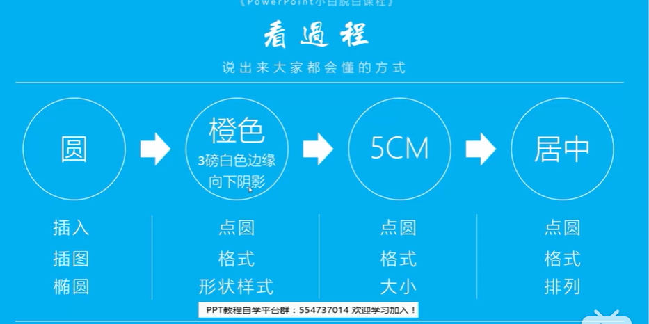
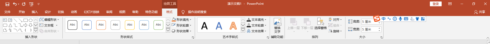
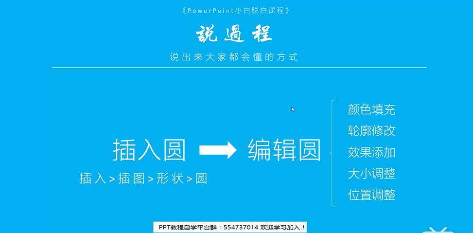
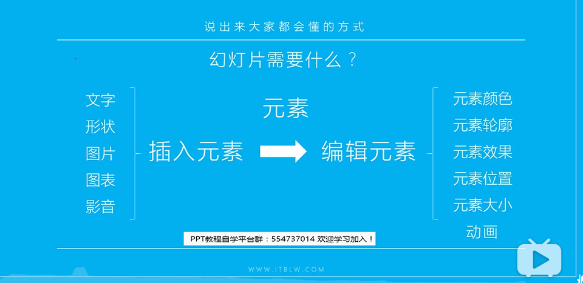

# PPT基础

## 1. 画圆

### 操作

### 点击圆后在下面菜单中操作

### 具体过程

### 幻灯片制作过程

### 快速将一个word文档转化为PPT

全选文本内容,点击上方的**视图**选项,下面从左往右数有**大纲**,点击大纲,弹出设置大纲视图的页面,选择内容,设置其中的视图等级为1级或者2级,如果是文本内容那么将不会显示

设置完成之后,关闭大纲视图

将文档内容快速发送到PPT,点击文件,点击左边的选项,点击快速访问工具栏,在左边的4分之1的位置,有一个发送到Microsoft PowerPoint选项,点击将其添加到右边,点击确认,在最上方的刷新图标右边,可以快速将文档内容发送到PPT处

将内容导入PPT后,还需要点击视图,选择大纲视图,全选内容,然后回到开始,其中有一个红色的橡皮檫,点击它然后返回普通视图即可

美化上面生成的ppt

1. 点击设计选项卡,选择主题母版,在右边有一个向下的箭头,点击它选择这个主题的字体的内容
2. 给标题页面设置版式,在开始标签设置一个版式,选择标题选项幻灯片版式,可以对版式里面的内容进行修改,在这里可以在字体部分修改字体的大小和形状
3. 修改幻灯片模板的格式,点击视图,下面有一个幻灯片母版,修改这个母版中的内容
4. 对内容页中的版式进行修改,对内容进行一个自定义母版的格式的设置,设置好之后可以将其自定义创建一个母版用于其他的页面

创建母版的过程:
1. 将已经设置好的版式复制一下,打开视图,点击幻灯片母版,点击左下方空白处,点击插入版式,粘贴,复制这个幻灯片版式
2. 使用格式刷,设计好的模板点击一下,返回开始,点击格式刷,返回正在创建的版式,点击需要这个版式的位置即可

3. 在需要插入文本照片等的内容,可以直接使用插入占位符,然后使用格式刷,将对应的版式插入进去
4. 待版式设置完成之后,可以选中剩下所有的幻灯片,点击开始,点击版式,选中我们刚设计好的版式,这样接下去所有的幻灯片都将使用我们先前使用的版式
5. 如果我们要在全部的版式上加入对应的内容,可以点击视图,幻灯片母版,然后在最上面的页面添加对应的内容即可
6. 最后选中所有的幻灯片,点击切换,可以选择幻灯片的切换顺序

